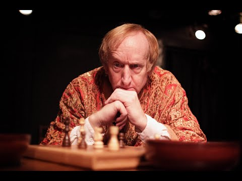
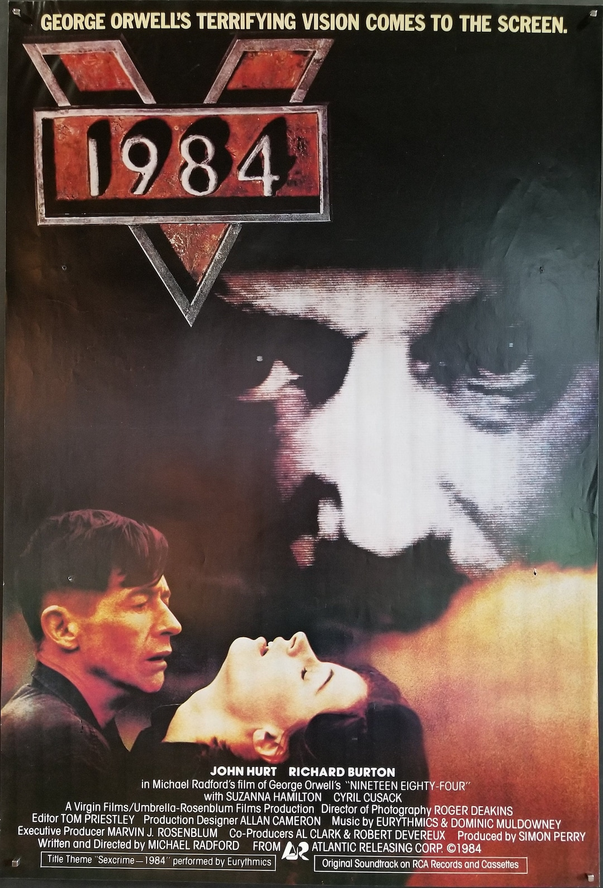
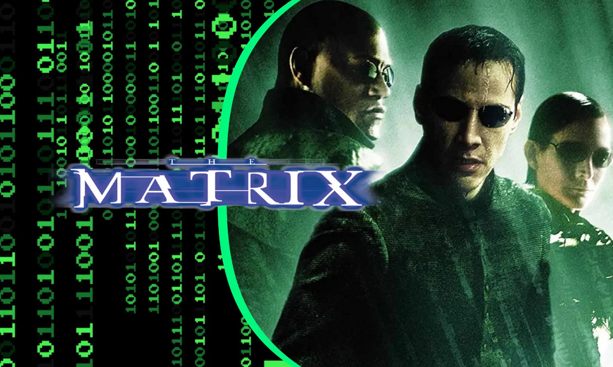

::: {.section-block .hero-title}
:::

::: {.meta-info}
**Title:** Tales of Defiance to Mind Control in the Modern Age  
**Title Abbreviation:** DMC  
**Study Group Leader:** Scott Axelrod  
**Meeting Times/Dates:** Mondays, Period 2 (11:10 am - 12:35 pm), November 2-30  
**Location:** 51 Sawyer Road, Room ?  
**Contact:** axelrod@alumni.princeton.edu  
**Course Number:** HG19-LIT-5b-Mon2-F26  
**Preparation time:**  2-3 hours per week, which includes time to
watch the movies and read some additional materials.

:::

<!-- 
:::: {.section-block .yellow}

## Testing stuff

- Hi, this is a test.

::::
-->

::: {.section-block .light-blue}
# Course Description in BOLLI Course Catalog

Are you concerned about the increasingly sophisticated ways social forces are attempting to control your mind?  In this course we examine four different mind control scenarios as depicted in four seminal works of fiction.  In each case, the lead character seeks to defiantly challenge a specific threat to mental autonomy.   Taken together, these works of fiction (three films and a short story) trace an arc of defiance against increasingly sophisticated and multi-layered methods of thought control.  

We begin with a filmed one-man play version of Fyodor Dostoevsky’s *Notes from the Underground* -- a visceral scream against a world that imposes rationalism as the highest ideal. Next, in a film adaptation of George Orwell’s *1984*, "Big Brother" uses totalitarianism and a vocabulary of submission to colonize the inner self.     From there we enter the digital age with *The Matrix* (the Wachowskis' 1999 film), exploring an engineered reality that replaces the physical world entirely.    Finally, Ken Liu’s short story *The Perfect Match* (2012) confronts invisible control through the "corporate nudge" of algorithms and big data.

Applying literary analysis, philosophy, and social theory,  we examine how power and psychology shape what we call "real."  In discussing these narratives, we aim to build the intellectual muscles that each of us needs to navigate a world fractured by algorithms, social media, and the onslaught of  AI, all the while resisting the persistent pull of old-fashioned ideological brainwashing. 

<!--

## Pre-committee first paragraph:

Who creates and controls our perception of reality? Is true mental autonomy still possible? 
Has our individual mental freedom been taken away from us? 
Have we traded it for the comfort of a pre-packaged life? 
We will see how characters confront these questions in four seminal works of fiction. 
They trace an arc of defiance against worlds with increasingly sophisticated, multi-layered methods of controlling the mind.

-->

:::

::: {.section-block .white}
# Objectives

Students should develop skills for analyzing and discussing various methods of societally imposed mind control. 
We will discuss strategies for recognizing and responding to such influences. 
Students should leave the course with a better understanding of how to adapt these strategies to their own personalities.

:::

::: {.section-block .light-blue}
# Course Topics by Week

## Week 1, Nov. 2:  Introduction, *Notes from the Underground*

### Course Overview:  

- In each of the first four weeks, we will focus on a tale of societally imposed mind control and (at least one) tool, or lens, to examine the story.
- This gives an increasingly sophisticated, multi-layered  arc of stories and lenses.
- Even while new forms of control emerge, the old ones are still present today.   
   People are still rebelling ...

  1.  against The Enlightenment, as the Underground Man did in *Notes from the Underground*;
  2.  against state control of truth, as Winston Smith did in *1984*;
  3.  against a virtual fake reality, as Neo did in *The Matrix*; and
  4.  against companies controlling us by telling us what we want, as Sai did in *The Perfect Match*.

- The lenses used to look at each story are actually questions that apply to all stories:

  1. Human Outlier Analysis:  How are people outside of the "normal" for society treated? 
  2. Narrative Analysis: How are stories told, and how does that effect  people?   
  	 The Police State:  Is the government completely controlling civil society?
  3. Societal Control Analysis: What are the mechanisms by which society exerts control to constrain its members?
  4. False needs: How are people manipulated into acting based on a sense of what they need?   
	  Surveillance capitalism: How does constant surveillance affect people in society?

### *Notes from the Underground*

- Feelings/complexity are suppressed by dominance of simple rationalism. 
- Early enlightenment models of deeply surveilled prisons and mental hospitals used to isolate and outcast people with "crazy" thoughts.
- Those who control what thoughts are "acceptable" control the perceived reality.

## Week 2, Nov. 9: *1984*

  - Connection to *Notes from the Underground*, *We*, *Brave New World*.

  - *1984*:
     - Independent thoughts and feelings are disallowed under totalitarianism. 
     - This is enforced by surveillance and control of language and media.
     - Those who control the narrative control the perceived reality.

## Week 3, Nov. 16: *The Matrix* 

  - People are living inside a computer simulation.
  - They cannot perceive that their reality is constructed and controlled by the architects of the digital world.
  - Those who control information we receive control the perceived reality.

## Week 4, Nov. 23: *The Perfect Match* 

  - Independent thoughts and feeling are not possible because algorithm and bots constantly "nudge" people what to think and feel.
  - People are lured by comfort of a constructed, false-but-pleasant narrative.
  - Who provides the most comfort controls the perceived reality. 

## Week 5, Nov. 30: Final Wrap-up

- Pulling it all together and looking forward.

:::

:::: {.section-block .white}

#  Course Materials 

The core of the course consists of four stories, which can be accessed by the links below.

Note: When this file is viewed as a web page, each Link below opens in a new browser tab.

Additional/optional materials will be provided on the class website and in email.

## ["Notes from the Underground," one-man show starring Larry Cedar](https://www.youtube.com/watch?v=asp5tqDql0g),  1:32:06, free on YouTube

{width=50%}  <!-- image from https://img.youtube.com/vi/asp5tqDql0g/hqdefault.jpg -->

## ["1984" movie directed by Michael Radford](https://tubitv.com/movies/300443/1984?resume_time=1),  1:50:33, free on Tubi TV

{width=50%}

##  *The Matrix* movie, written and directed by the Wachowskis, 2:16:20

- [$3.99 to rent on YouTube.  Need to create a free YouTube login.](https://www.youtube.com/watch?v=GuE0Mtr-w6g)
- [$3.99 to rent, $14.99 to buy on Amazon Prime Video.  Need an Amazon Prime account.](https://www.amazon.com/gp/video/detail/B0B6DB8G7C/ref=atv_dp_amz_c_yxuuUK_1_1)

{width=50%} <!-- Image from: https://facts.net/wp-content/uploads/2023/06/47-facts-about-the-movie-the-matrix-1687246419.jpg -->

## ["The Perfect Match," free on lightspeed magazine](https://www.lightspeedmagazine.com/fiction/the-perfect-match/)

{width=50%} <!-- Image from: https://ecdn.teacherspayteachers.com/thumbitem/-The-Perfect-Match-Short-Story-by-Ken-Liu-2-Day-Lesson-Digital-Print--9912050-1693253669/original-9912050-1.jpg -->

::::

::: {.section-block .light-blue}
# SGL Biography

In his career as a mathematical physicist, Scott Axelrod studied geometrical quantum field theories as an assistant professor of mathematics at MIT, before working on nuclear magnetic resonance, natural language processing, and finance in industry. On the humanistic side, Scott has self-published books "Off the Deep End: Diary of a Mathematician", "Infinite Regress", and "After-Time". Much of the latter book consists of essays for the BOLLI Writers Guild. He has several other works in progress. Scott is looking forward to his first-time teaching experience at BOLLI.
:::
