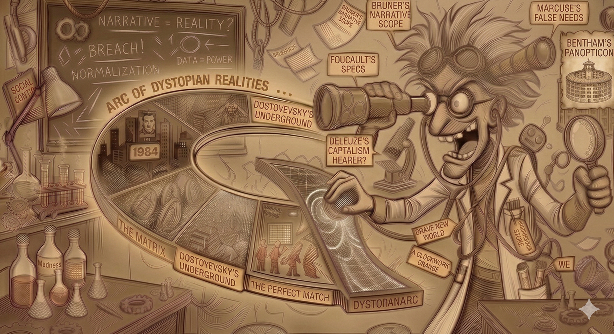
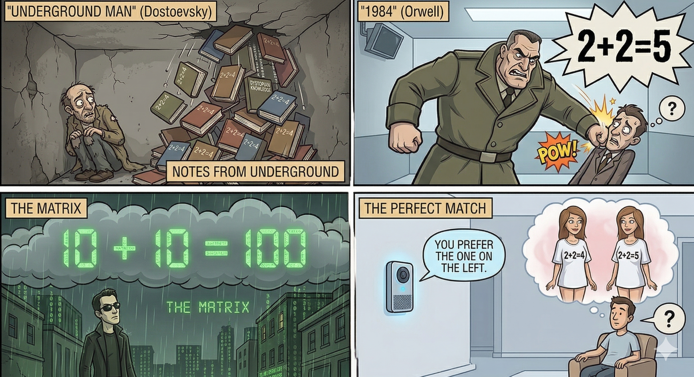
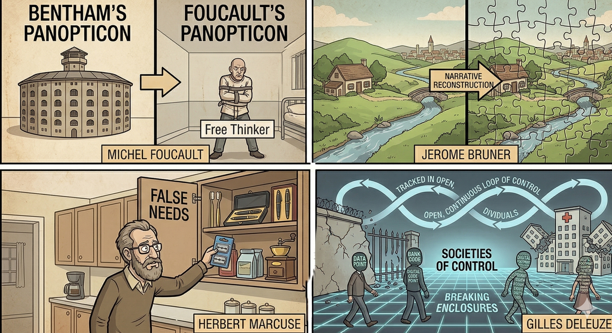
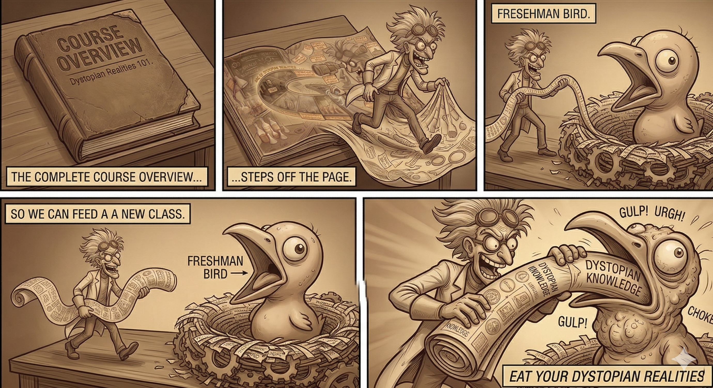
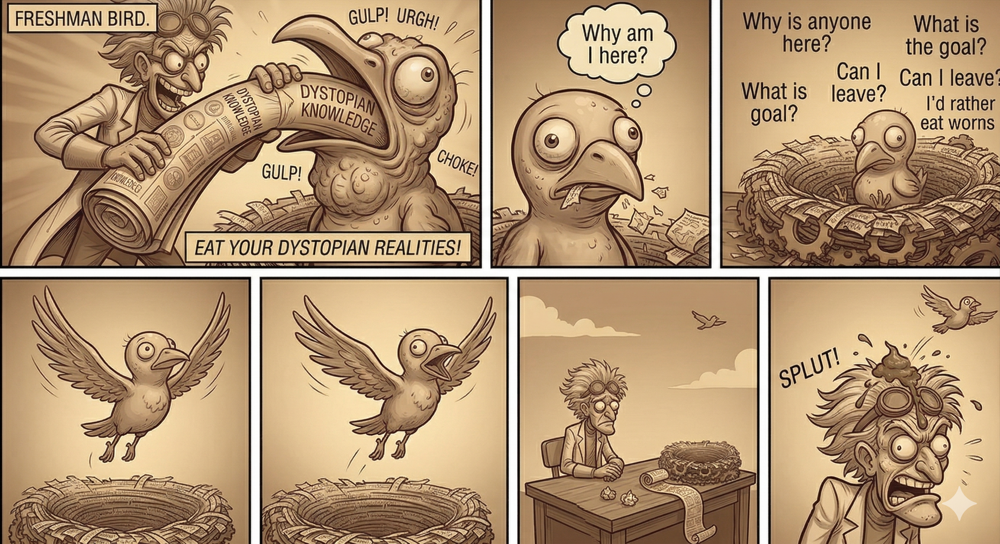

\newpage

# Course Overview:

\

{width=90%}<!--  =250x) -->

<!--  <!-- % width="250px" or "width=50%" -->

- Look at modern age stories where societies impose/offer mind control.
- Consider characters who are rebelling.
- Ask questions through various lenses.

\newpage

# Stories in The Dystopian Arc 

{width=90%}

- Dostoyevsky's Undeground Man, isolated and being crushed by 2+2=4 reason .
- Winston from "1984" being pounded by Big Brother to truly believe 2+2=5.
- Neo from "The Matrix" perceiving that his entire world is a computer simulation, seeing the simulation of 2+2=4 in binary.
- Sai from "The Perfect Match" being nudged by the AI agent Tilly to tell him that he prefers the beautiful girl in the "2+2=4" T-shirt.

\newpage

# Some Lenses

{width=90%}

- **Michel Foucault:** 
   - The panopticon (prison) of thought. 
   - The surveillance state.
   - Postmodernism. 
   - Civilization constraining madness.
- **Jerome Bruner:**  Narrative Analysis
- **Herbert Marcuse:** Control through false needs.
- **Gilles Deluze:** 
  - Foucault’s "enclosures" (prisons, schools, hospitals) are breaking down.
  - We are no longer "individuals" in a room; we are "dividuals"—data points, bank codes, and digital footprints that are tracked in an open, continuous loop of control.
  - It’s not about being locked in a cage; it’s about being part of a network where the "control" is fluid and constant.

\newpage

# Course Parody:

\

{width=90%}

- I can get pretty excited by my own stuff.
- Watch out that I don't force a point of view on you.

\newpage

# Course Goals:

\

{width=90%}

- You should ask questions.
- Thought-opening not thought-stopping.
- So you can fly away in your own individual way.
- Even if it means rejecting my framing.
- gary larson:
   - two prisoners handing by rests, just cloth on privates, dirty, beards
   - little window with bars
   - one looking out: "hey, I can see me house from here"
   
   
